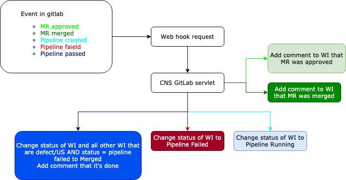

# Gitlab Webhooks CNS Servlet

This servlet can perform actions on merge request(MR) and pipeline events (webhooks).

## Properties

Following list of properties needs to be set in *polarion.properties* file.

```
gitlab.webhook.userKey=user-account-vault-key
gitlab.webhook.token=secret-token-configured-in-gitlab
gitlab.webhook.pipelineFailedAction=action-id-for-pipeline-failed
gitlab.webhook.pipelineRunningAction=action-id-for-pipeline-running
gitlab.webhook.pipelinePassedAction=action-id-for-pipeline-pass
gitlab.webhook.pipelineFailedStatus=status-id-for-pipeline-failed
gitlab.webhook.finalStatus=final-status
gitlab.webhook.projectId=project-id
gitlab.webhook.pipelineIdField=integer-custom-field-id
```

## Behavior

Branch must be named like pi_WI-123_description
Reacts only on master pipeline events.



Following scenarios are performed:
#### MR approved
- Adds comment that merge request was approved by whome

#### MR merged
- Adds comment that merge request was merged by whome

#### Pipeline started
- Check if stored pipeline id is not empty and pipeline id is not older than stored one
- Perform workflow action *action-id-for-pipeline-running*
- If workitem status is not *final-status* and stored pipeline id is null or older then current pipeline id
    - Stores pipeline id to custom field with id *integer-custom-field-id*
    - Adds comment that pipeline started

#### Pipeline failed
- Check if stored pipeline id is not empty and pipeline id is not older than stored one
- Perform workflow action *action-id-for-pipeline-failed*
- Adds comment that pipeline failed

#### Pipeline succeeded
- Check if stored pipeline id is not empty and pipeline id is not older than stored one
- Perform workflow action *action-id-for-pipeline-pass*
- Adds comment that pipeline succeeded
- Query all work items that have status *status-id-for-pipeline-failed* and pipeline id is grater than their stored pipeline id and perform workflow action *action-id-for-pipeline-pass* + add comment as well
